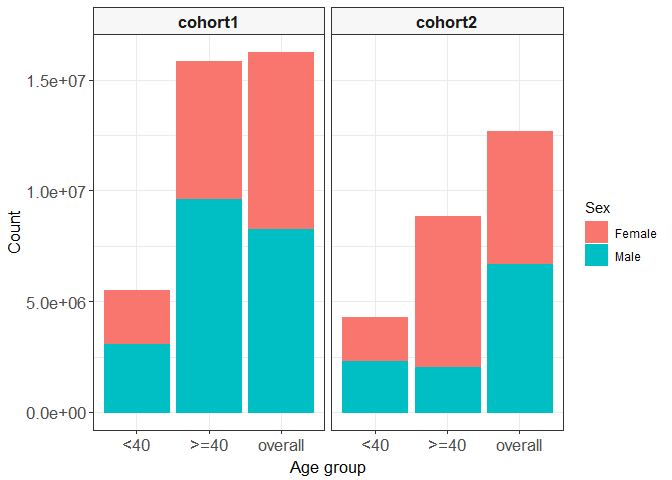

<!-- README.md is generated from README.Rmd. Please edit that file -->

# visOmopResults 

<!-- badges: start -->

[](https://github.com/darwin-eu/visOmopResults/actions/workflows/R-CMD-check.yaml)
[](https://CRAN.R-project.org/package=visOmopResults)
[](https://lifecycle.r-lib.org/articles/stages.html#experimental)
[](https://app.codecov.io/gh/darwin-eu/visOmopResults?branch=main)
<!-- badges: end -->

## Package overview

**visOmopResults** offers a set of functions tailored to format objects
of class `<summarised_result>` (as defined in
[omopgenerics](https://cran.r-project.org/package=omopgenerics)
package).

It provides functionality to create formatted **tables** and generate
**plots**. These visualizations are highly versatile for reporting
results through Shiny apps, RMarkdown, Quarto, and more, supporting
various output formats such as HTML, PNG, Word, and PDF.

## Let’s get started

You can install the latest version of visOmopResults from CRAN:

``` r
install.packages("visOmopResults")
```

Or you can install the development version from
[GitHub](https://github.com/darwin-eu/visOmopResults) with:

``` r
# install.packages("pak")
pak::pkg_install("darwin-eu/visOmopResults")
```

The `<summarised_result>` is a standardised output format utilized
across various packages, including:

- [CohortCharacteristics](https://cran.r-project.org/package=CohortCharacteristics)
- [DrugUtilisation](https://cran.r-project.org/package=DrugUtilisation)
- [IncidencePrevalence](https://cran.r-project.org/package=IncidencePrevalence)
- [PatientProfiles](https://cran.r-project.org/package=PatientProfiles)
- [CodelistGenerator](https://cran.r-project.org/package=CodelistGenerator)
- [CohortSurvival](https://cran.r-project.org/package=CohortSurvival)
- [CohortSymmetry](https://cran.r-project.org/package=CohortSymmetry)

Although this standard output format is essential, it can sometimes be
challenging to manage. The *visOmopResults* package aims to simplify
this process. To demonstrate the package’s functionality, let’s start by
using some mock result:

``` r
library(visOmopResults)
result <- mockSummarisedResult()
```

## Tables visualisations

Currently all table functionalities are built around 3 packages:
[tibble](https://cran.r-project.org/package=tibble),
[gt](https://cran.r-project.org/package=gt), and
[flextable](https://cran.r-project.org/package=flextable).

There are two main functions:

- `visOmopTable()`: Creates a well-formatted table specifically from a
  `<summarised_result>` object.
- `visTable()`: Creates a nicely formatted table from any `<data.frame>`
  object.

Let’s see a simple example:

``` r
result |>
  visOmopTable(
    type = "flextable",
    estimateName = c(
      "N(%)" = "<count> (<percentage>%)", 
      "N" = "<count>", 
      "mean (sd)" = "<mean> (<sd>)"),
    header = c("sex"),
    settingsColumn = NULL,
    groupColumn = c("cohort_name", "age_group"),
    rename = c("Variable" = "variable_name", " " = "variable_level"),
    hide = "cdm_name"
  )
```


## Plots visualisations

Currently all plot functionalities are built around
[ggplot2](https://cran.r-project.org/package=ggplot2). The output of
these plot functions is a `<ggplot2>` object that can be further
customised.

There are three plotting functions:

- `plotScatter()` to create a scatter plot.
- `plotBar()` to create a bar plot.
- `plotBox()` to create a box plot.

Let’s see how we can create a simple boxplot for age using this tool:

``` r
library(dplyr)
result |>
  filter(variable_name == "number subjects") |>
  filterStrata(sex != "overall") |>
  barPlot(x = "age_group", 
          y = "count",
          facet = "cohort_name", 
          colour = "sex")
```


